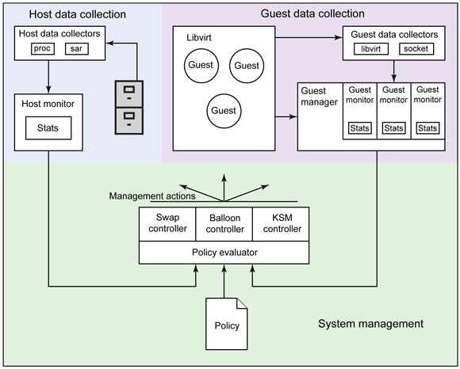

# KubeMom

MOM ([Memory Overcommitment Manager](https://www.ovirt.org/develop/projects/mom.html)) is a component in a virtual environment that applies pre-defined policies that adjust KSM, ballooning, [and optionally other resource management feature](https://www.ibm.com/developerworks/library/l-overcommit-kvm-resources/) to facilitate memory-overcommitment in the nodes that Virtual Machines run on.

This project is about implementing MOM as an optional controller in a Kubernetes cluster that would do the same for enabling memory-overcommitment in [KubeVirt](https://kubevirt.io/) nodes, i.e., nodes that run KVM virtual machines within Kubernetes Pods.

## Architecture
The high-level design of MOM is depicted in the following diagram:

MOM is comprised of three main layers:
- Host data collection: this layer retrieves information about the node that the virtual machines run on.
- Guest data collection: this layer retrieves information about the virtual machines that run on the node.
- System management: this layer applies predefined policies that convert data that is retrieved by the two aforementioned layers into actions that are sent to the appropriate resource management entities.

## Challenges
The requirements for KubeMom can be split to two groups: (1) Things that come from its implementation as an extension to KubeVirt; and (2) Improvements to the existing MOM project that was implemented to [oVirt](https://ovirt.org/).

Among the first group are the following requirements:
- Containerizing the MOM application.
- Retrieving node-level data via [Node-Exporter](https://github.com/prometheus/node_exporter/blob/master/README.md).
- Retrieving guest(VM)-level data from KubeVirt (See this [trello card](https://trello.com/c/izETePlZ/79-8epic-detailed-monitoring-expose-vm-internal-metrics-initiative-perfscale-baseline)).
- Sending actions to the node-level KSM.
- Sending actions to the guest-level ballooning.

Among the second group are the following requirements:
- Replacing the lisp-like scripting language for policy definition with [a more declarative language](https://ovirt.org/develop/release-management/features/sla/mom-declarative-language.html).
- Enabling to adjust policies according to VM-lifecycle events (e.g., configuring the policy differently when VM boots compared to when the guest operating system is already up).

## Approach
